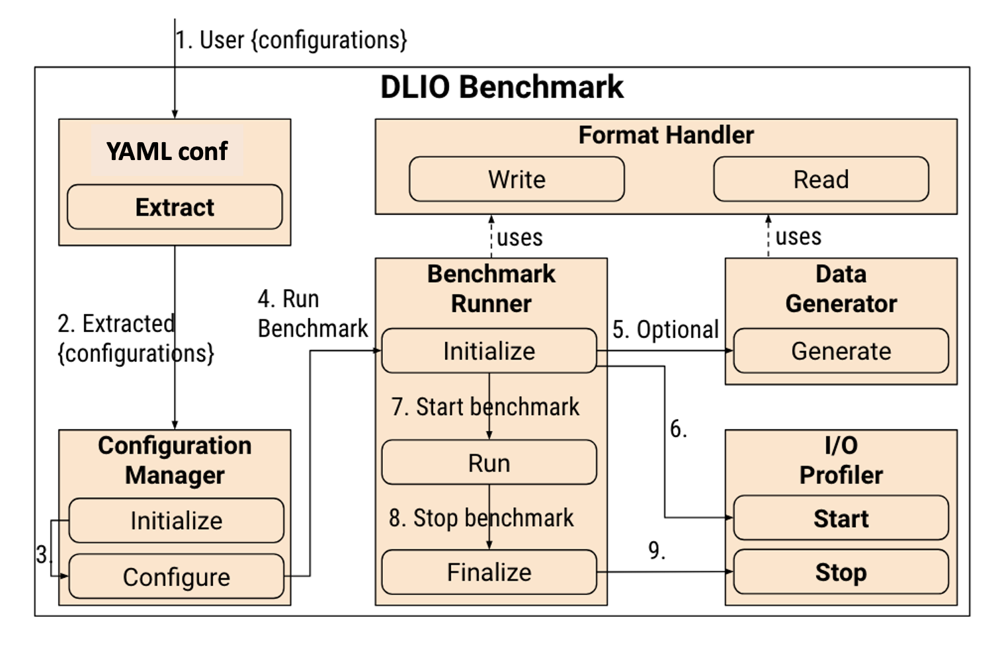

Introduction
=============
Deep learning has proven to be highly effective across various tasks, leading to the development of numerous open-source deep learning tools like TensorFlow, PyTorch, MXNet, and Horovod. Its application spans diverse scientific domains, including cosmology, particle physics, computer vision, fusion, and astrophysics. However, the success of deep learning algorithms is contingent upon substantial volumes and varieties of big data for accurate neural network training, thereby posing a significant challenge in large-scale distributed deep learning training due to potential I/O bottlenecks.

The `DLIO`` benchmark aims to meticulously represent the data access patterns of deep learning workloads, allowing accurate emulation of I/O behavior during training. By leveraging `DLIO`, application developers and system software architects can pinpoint potential I/O bottlenecks and guide optimizations to enhance performance. Storage hardware vendors can also utilize the DLIO benchmark as a guide in designing storage and file systems tailored for deep learning applications.

High-level Design
=======================
The standard AI training process entails transferring datasets from storage to host RAM, then forwarding them to accelerators for training. Data is loaded in batches concurrently through multiple threads while accelerators execute training. After processing each batch, the accelerator triggers a request to the host, prompting the loading of another batch from storage. This iterative cycle guarantees uninterrupted data processing, contributing to the efficiency of the training process.

  .. figure:: ./images/training.png

    Typical process of AI training. 

Based on the training process shown above, we can have following considerations in designing the benchmark: 

Firstly, the data loading process is independent of the specific computation happening in the accelerator. We therefore can replace the computation part with a sleep function of equivalent duration, and still produce the same the I/O pattern. This is demonstrated with the UNet3D workload shown below. We replace the computation with a sleep of different durations corresponding to the training time in Nvidia A100, V100, and P100 GPUs, we were able to generate the I/O timeline of the real workload running on different GPUs. Replacing the training part with a sleep function eliminate the needs of actual accelerators to perform the I/O benchmark, which significantly reduces the cost and complexity of benchmarking. It also allows us to simulate the I/O pattern for different types of accelerators easily by simply changing the sleep time accordingly.

  .. figure:: ./images/validation.png

    Upper panel: I/O timeline on A100, V100, P100; Lower panel: I/O timeline on Skylake with training replaced by sleep of different durations equal to the actual training time on A100, V100 and P100 respectively. 

Secondly, the I/O process is indifferent to the actual values of the data. As long as the number of files, number of samples per file, size of each sample, batch size, and format are the same, the I/O behavior should be similar regardless of the details of each sample. This allows us to use synthetic data for benchmarking and still get the similar I/O behavior. This eliminates the need of downloading the original datasets for each workload which is a rather cumbersome task. 

Third, we will adopt built-in framework data loaders, such as tf.data, torch DataLoader, and Dali data loader, to allow DLIO to simulate advanced optimization features like pipeline, prefetching, and multithreaded data loading.  

With the above considerations, we design our benchmark using a modular design artitecture, which consists of modules like
**Benchmark Runner**, **Data Generator**, **Format Handler**, and **I/O Profiler**. These modules utilize state-of-the-art design patterns to build a transparent and extensible framework. 

1) **Accurate**: `DLIO` should be an accurate representation of
selected deep learning applications. It should
incorporate all the I/O behavior seen in various configurations of applications,
 and act as a mini-application that can precisely replay the I/O behavior. 

2) **Configurable**: `DLIO` should be easily configurable for
different scenarios required by the user. These include
features such as different ratio-of-computation to I/O, multi
threading for I/O, data operators (e.g., decoding, shuffling,
prefetch, and batching), and mechanism to feed data into training.

3) **Extensible**: `DLIO` benchmark should allow adding
custom data directories and enable easy extensions to the
benchmark to incorporate different data formats, data loaders 
or data generation algorithms. 
These changes should not affect the basic benchmark operations.

''''''''''''''''''''
`DLIO` Code Modules
''''''''''''''''''''
Below shows the modules of the `DLIO` code. 

* **Configuration Manager**: the user specifies a YAML file which represents the characteristics of a real workload. The configuration manager will load the configuration into `DLIO`. 

* **Format Handler**: Format Handler will handle the data read and write for specific data format. 

* **Data Generator**: this is for generating synthetic datasets. This eliminates the dependence on real dataset which is typically difficult to get. `DLIO` can generate synthetic data in different formats, different organization and layouts on the storage, such as: 

  * Single shared file in which the entire datasets is stored in one file. 
  * One samples per file
  * Multiple samples per file
  * Files putting in a single folder. 
  * Files putting in many subfolders.  

* **Benchmark Runner**: this is for performing the whole benchmarking process, including data generation, training, evaluation, checkpointing, profiling, etc. 

'''''''''''''''''''''''
Benchmark Execution
'''''''''''''''''''''''
**Configuration**: The YAML configure file is first parsed and extracted into configurations for the benchmark. The extracted configurations are passed to the Configuration Manager, which is first initialized with default benchmark values and then updates itself with the incoming configurations. At this stage, incompatible/incorrect configurations would be thrown as error back to the users. A complete instruction on how to prepare the YAML file can be found in :ref:`yaml`. 

**Data generation**: Once the configurations are validated and applied, the benchmark runner is invoked. The runner initializes prepared data (if needed) and then starts the profiling session. 

**Simulation**: Once the session has started successfully, the benchmark Run() is invoked, which runs the benchmark. In the run phase, we run the benchmark for multiple epochs. During each epoch, the whole data is read once using n steps. During an epoch, checkpoint operations are performed every c steps as well. 

Additionally, an inter-step computation is performed to emulate computation (through a sleep function) and I/O phases by deep learning application. Replacing computaiton with sleep allows the user to perform the benchmark in a acclerator absence environement. Different accelerators will have different amounts of computation time. 

Finally, once the benchmark run finishes, the finalize is called, which stops the profiler, saves its results, and exits the benchmark.

**Post processing**: One can then use the post processing script to process the logs to produce a high level summary of the I/O performance. 

