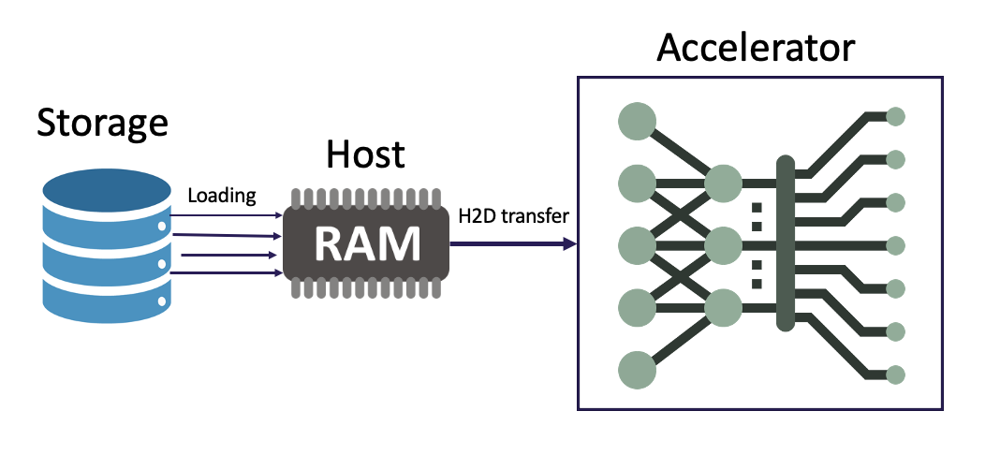

Introduction
=============

Deep learning has been shown as a successful
method for various tasks, and its popularity results in numerous
open-source deep learning software tools. Deep learning has
been applied to a broad spectrum of scientific domains such
as cosmology, particle physics, computer vision, fusion, and
astrophysics. Scientists have performed a great deal of work
to optimize the computational performance of deep learning
frameworks. However, the same cannot be said for I/O performance. As deep learning algorithms rely on big-data volume and
variety to effectively train neural networks accurately, I/O is
a significant bottleneck on large-scale distributed deep learning
training. 

The DLIO benchmark aims to provide a detailed representation of
the I/O behavior of deep learning workloads. DLIO can be utilized to accurately emulate the I/O behavior of modern deep learning
applications. Using DLIO, application developers and system
software solution architects can identify potential I/O bottlenecks
in their applications and guide optimizations to boost the I/O
performance. The storage vendors can also use DLIO benchmark as a guidance for storage and file system design. 

---------------------
High-level Design
---------------------

The DLIO benchmark is aimed at emulating
the behavior of deep learning applications. The
benchmark is delivered as an executable that can be configured
for various I/O patterns. It uses a modular design to incorporate
more data formats, datasets, and configuration parameters. It
emulates deep learning applications using
Benchmark Runner, Data Generator, Format Handler, and I/O
Profiler modules. These modules utilize state-of-the-art design
patterns to build a transparent and extensible framework. The
DLIO benchmark has been designed with the following goals.

1) Accurate: DLIO should be an accurate representation of
selected scientific deep learning applications. It should
incorporate all the I/O behavior seen in various configurations of applications, and act as a
mini-application that can precisely mimic the I/O behavior. 

2) Configurable: DLIO should be easily configurable for
different scenarios required by the user. These include
features such as the ratio-of-computation to I/O, available
threads for I/O, data operators (e.g., decoding, shuffling,
and batching), and mechanism to feed data into training.

3) Extensible: DLIO benchmark should allow adding
custom data directories and enable easy extensions to the
benchmark to incorporate different data formats, data loaders or data
generation algorithms. These changes should not affect
the basic benchmark operations.

'''''''''''''''''''''''''''
Validity of DLIO Benchmark
'''''''''''''''''''''''''''
DLIO relies on two important assumption: 

1) One can replace the computation part (training and validation) with sleep of the same amount of time, while the I/O pattern / behavior remains the same. The logic behind this is as follows. The following figure shows a schematic picture of a typical training process. At each time step, a batch of data is loaded from the storage to host memory, and then transfered to GPU to perform the training. In this case, the I/O (data access in the storage) is independent on what is going on in the accelerator, as long as the frequency of the I/O requests remains the same. We have validated this in various cases. The results were presented in our CCGrid paper. 

2) One can have certain abstraction of the dataset and igore the low level details. For the data loading part, we would keep it as close as possible to the real workloads where as maintain a high level of abstraction to make it able to represent a broad spectrum of workloads. We assume that as long as the number of files, number of samples per file, size of each sample, batch size, are the same, the I/O behavior should be similar regardless of the details of each sample. We have build in dataloaders such as tf.data, and torch DataLoader to incorporate advance features such as prefetch, and multithreaded data loader. 

'''''''''''''''''''''''''
DLIO code modules
'''''''''''''''''''''''''
.. image:: images/dlio.png

DLIO contains the following modules
* Configuration Manager: the user specify a YAML file which represents the characteristics of a real workload. The configuration manager will load the configuration into DLIO. 
* Format Handler: Format Handler will handle the data read and write for specific data format. 
* Data generator: this is for generating synthetic datasets. 
* Benchmark runner: this is for performing the whole benchmarking process, including data generating, training, evaluation, checkpointing, profiling, etc. 

'''''''''''''''''''''''''
Workload Configuration
'''''''''''''''''''''''''
The characteristics of a workload are specified through a set of configuration which is represented in a workload YAML file. Below is an example of a YAML file

.. code-block::
  
  model: unet3d

  framework: pytorch

  workflow:
    generate_data: True
    train: True
    evaluation: True

  dataset: 
    data_folder: ./data/unet3d/
    format: npz
    num_files_train: 3620
    num_files_eval: 42
    num_samples_per_file: 1
    batch_size: 4
    batch_size_eval: 1
    file_access: multi
    record_length: 1145359
    keep_files: True
  
  data_reader: 
    data_loader: pytorch
    read_threads: 4
    prefetch: True

  train:
    epochs: 10
    computation_time: 4.59

  evaluation: 
    eval_time: 11.572
    epochs_between_evals: 2

In this YAML file, 
* The "framework" block specify the framework to use. 
* The "workflow" block specify the operations to perform, such as data generation, training, evaluation, debugging, profiling, etc. 
* The "dataset" block defines all the information related to the dataset, including location of the dataset (data_folder), data format, number of files, batch size, the size of sample, etc. 
* The "data_reader" block defines how the data is read, including the data loader to use, number of I/O threads, whether to perform prefetch, etc
* The "train" block defines the training process, such as number of epochs, computation time per training step, etc. 
* The "evaluation" block defines the evaluation (validation) process, such as the evalulation time per time step, the frequency of doing evaluations (epochs_between_evals, steps_between_evals). 

'''''''''''''''''''''
Dataset Generation
'''''''''''''''''''''
We have a dataset generation module, which can generate synthetic datasets base on the configuration specified in the YAML file. This eliminates the dependence on real dataset which is typically difficult to get. One can also scale the dataset to study the I/O load for large scale dataset. The dataset generation process can be done in parallel. 

'''''''''''''''''''''''
DLIO excution
'''''''''''''''''''''''
The YAML file is first parsed and extracted into configurations for the benchmark. The extracted configurations are passed to the Configuration Manager, which is first initialized with default benchmark values and then updates itself with the incoming configurations. At this stage, incompatible/incorrect configurations would be thrown as error back to the users. Once the configurations are validated and applied, the benchmark runner is invoked. The runner initializes prepared data (if needed) and then starts the profiling session. Once the session has started successfully, the benchmark Run() is invoked, which runs the benchmark. In the run phase, we run the benchmark for several epochs. During each epoch, the whole data is read once using n steps. During an epoch, checkpoint operations are performed every c steps as well. Additionally, an inter-step computation is performed to emulate computation and I/O phases by deep learning application. Finally, once the benchmark run finishes, the finalize is called, which stops the profiler, saves its results, and exits the benchmark.

As we have mentioned, we can replace the computation part of a workload with sleep of the same amount of time. Replacing with sleep allows the user to perform the benchmark in a acclerator absence environement. As long as the host is similar to where the real application will run. The computation time can be specified in the configuration file. Different accelerators will have different amount of computation time. 

