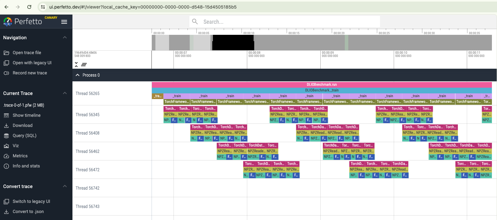

.. _profiling: 

Profiling 
==========================
We have a built in support for iostat and DLIO profiler for I/O profiling. Below are instructions on how to use the two profiling tools in `DLIO`. 

iostat profiling
---------------------
To enable iostat profiling, one can set ``workload.workflow.profiling=True`` and ``workload.profiling.profiler=iostat``, and set the devices list such as '[sda, sdb]'. This will generate iostat.json file in the output folder. One can then post process the output and get out bandwidth information for the run. 

.. code-block:: bash 

    dlio_postprocessor --output-folder hydra_log/unet3d/2022-11-09-17-55-44/

The output is

.. code-block:: text

    ===============Processing DLIO output================
    Job configuration
    output_folder: hydra_log/unet3d/2023-06-27-21-27-12
    hydra_folder: ./.hydra
    num_proc: 8
    epochs: 5
    batch_size: 4
    do_eval: False
    batch_size_eval: 1
    do_checkpoint: True
    debug: False
    name: unet3d
    2023-06-27 21:38:00 Generating Report
    2023-06-27 21:38:00 Calculating Loading and Processing Times
    2023-06-27 21:38:00 Reading from hydra_log/unet3d/2023-06-27-21-27-12/0_output.json
    2023-06-27 21:38:00 Processing loading and processing times for epoch 1
    2023-06-27 21:38:00 Processing loading times for phase block1
    2023-06-27 21:38:00 Processing processing times for phase block1
    2023-06-27 21:38:00 Processing loading and processing times for epoch 2
    2023-06-27 21:38:00 Processing loading times for phase block1
    2023-06-27 21:38:00 Processing processing times for phase block1
    2023-06-27 21:38:00 Processing loading and processing times for epoch 3
    2023-06-27 21:38:00 Processing loading times for phase block1
    2023-06-27 21:38:00 Processing processing times for phase block1
    2023-06-27 21:38:00 Processing loading and processing times for epoch 4
    2023-06-27 21:38:00 Processing loading times for phase block1
    2023-06-27 21:38:00 Processing processing times for phase block1
    2023-06-27 21:38:00 Processing loading and processing times for epoch 5
    2023-06-27 21:38:00 Processing loading times for phase block1
    2023-06-27 21:38:00 Processing processing times for phase block1
    2023-06-27 21:38:00 Reading from hydra_log/unet3d/2023-06-27-21-27-12/1_output.json
    2023-06-27 21:38:00 Processing loading and processing times for epoch 1
    2023-06-27 21:38:00 Processing loading times for phase block1
    2023-06-27 21:38:00 Processing processing times for phase block1
    2023-06-27 21:38:00 Processing loading and processing times for epoch 2
    2023-06-27 21:38:00 Processing loading times for phase block1
    2023-06-27 21:38:00 Processing processing times for phase block1
    2023-06-27 21:38:00 Processing loading and processing times for epoch 3
    2023-06-27 21:38:00 Processing loading times for phase block1
    2023-06-27 21:38:00 Processing processing times for phase block1
    2023-06-27 21:38:00 Processing loading and processing times for epoch 4
    2023-06-27 21:38:00 Processing loading times for phase block1
    2023-06-27 21:38:00 Processing processing times for phase block1
    2023-06-27 21:38:00 Processing loading and processing times for epoch 5
    2023-06-27 21:38:00 Processing loading times for phase block1
    2023-06-27 21:38:00 Processing processing times for phase block1
    2023-06-27 21:38:00 Reading from hydra_log/unet3d/2023-06-27-21-27-12/2_output.json
    2023-06-27 21:38:00 Processing loading and processing times for epoch 1
    2023-06-27 21:38:00 Processing loading times for phase block1
    2023-06-27 21:38:00 Processing processing times for phase block1
    2023-06-27 21:38:00 Processing loading and processing times for epoch 2
    2023-06-27 21:38:00 Processing loading times for phase block1
    2023-06-27 21:38:00 Processing processing times for phase block1
    2023-06-27 21:38:00 Processing loading and processing times for epoch 3
    2023-06-27 21:38:00 Processing loading times for phase block1
    2023-06-27 21:38:00 Processing processing times for phase block1
    2023-06-27 21:38:00 Processing loading and processing times for epoch 4
    2023-06-27 21:38:00 Processing loading times for phase block1
    2023-06-27 21:38:00 Processing processing times for phase block1
    2023-06-27 21:38:00 Processing loading and processing times for epoch 5
    2023-06-27 21:38:00 Processing loading times for phase block1
    2023-06-27 21:38:00 Processing processing times for phase block1
    2023-06-27 21:38:00 Reading from hydra_log/unet3d/2023-06-27-21-27-12/3_output.json
    2023-06-27 21:38:00 Processing loading and processing times for epoch 1
    2023-06-27 21:38:00 Processing loading times for phase block1
    2023-06-27 21:38:00 Processing processing times for phase block1
    2023-06-27 21:38:00 Processing loading and processing times for epoch 2
    2023-06-27 21:38:00 Processing loading times for phase block1
    2023-06-27 21:38:00 Processing processing times for phase block1
    2023-06-27 21:38:00 Processing loading and processing times for epoch 3
    2023-06-27 21:38:00 Processing loading times for phase block1
    2023-06-27 21:38:00 Processing processing times for phase block1
    2023-06-27 21:38:00 Processing loading and processing times for epoch 4
    2023-06-27 21:38:00 Processing loading times for phase block1
    2023-06-27 21:38:00 Processing processing times for phase block1
    2023-06-27 21:38:00 Processing loading and processing times for epoch 5
    2023-06-27 21:38:00 Processing loading times for phase block1
    2023-06-27 21:38:00 Processing processing times for phase block1
    2023-06-27 21:38:00 Reading from hydra_log/unet3d/2023-06-27-21-27-12/4_output.json
    2023-06-27 21:38:00 Processing loading and processing times for epoch 1
    2023-06-27 21:38:00 Processing loading times for phase block1
    2023-06-27 21:38:00 Processing processing times for phase block1
    2023-06-27 21:38:00 Processing loading and processing times for epoch 2
    2023-06-27 21:38:00 Processing loading times for phase block1
    2023-06-27 21:38:00 Processing processing times for phase block1
    2023-06-27 21:38:00 Processing loading and processing times for epoch 3
    2023-06-27 21:38:00 Processing loading times for phase block1
    2023-06-27 21:38:00 Processing processing times for phase block1
    2023-06-27 21:38:00 Processing loading and processing times for epoch 4
    2023-06-27 21:38:00 Processing loading times for phase block1
    2023-06-27 21:38:00 Processing processing times for phase block1
    2023-06-27 21:38:00 Processing loading and processing times for epoch 5
    2023-06-27 21:38:00 Processing loading times for phase block1
    2023-06-27 21:38:00 Processing processing times for phase block1
    2023-06-27 21:38:00 Reading from hydra_log/unet3d/2023-06-27-21-27-12/5_output.json
    2023-06-27 21:38:00 Processing loading and processing times for epoch 1
    2023-06-27 21:38:00 Processing loading times for phase block1
    2023-06-27 21:38:00 Processing processing times for phase block1
    2023-06-27 21:38:00 Processing loading and processing times for epoch 2
    2023-06-27 21:38:00 Processing loading times for phase block1
    2023-06-27 21:38:00 Processing processing times for phase block1
    2023-06-27 21:38:00 Processing loading and processing times for epoch 3
    2023-06-27 21:38:00 Processing loading times for phase block1
    2023-06-27 21:38:00 Processing processing times for phase block1
    2023-06-27 21:38:00 Processing loading and processing times for epoch 4
    2023-06-27 21:38:00 Processing loading times for phase block1
    2023-06-27 21:38:00 Processing processing times for phase block1
    2023-06-27 21:38:00 Processing loading and processing times for epoch 5
    2023-06-27 21:38:00 Processing loading times for phase block1
    2023-06-27 21:38:00 Processing processing times for phase block1
    2023-06-27 21:38:00 Reading from hydra_log/unet3d/2023-06-27-21-27-12/6_output.json
    2023-06-27 21:38:00 Processing loading and processing times for epoch 1
    2023-06-27 21:38:00 Processing loading times for phase block1
    2023-06-27 21:38:00 Processing processing times for phase block1
    2023-06-27 21:38:00 Processing loading and processing times for epoch 2
    2023-06-27 21:38:00 Processing loading times for phase block1
    2023-06-27 21:38:00 Processing processing times for phase block1
    2023-06-27 21:38:00 Processing loading and processing times for epoch 3
    2023-06-27 21:38:00 Processing loading times for phase block1
    2023-06-27 21:38:00 Processing processing times for phase block1
    2023-06-27 21:38:00 Processing loading and processing times for epoch 4
    2023-06-27 21:38:00 Processing loading times for phase block1
    2023-06-27 21:38:00 Processing processing times for phase block1
    2023-06-27 21:38:00 Processing loading and processing times for epoch 5
    2023-06-27 21:38:00 Processing loading times for phase block1
    2023-06-27 21:38:00 Processing processing times for phase block1
    2023-06-27 21:38:00 Reading from hydra_log/unet3d/2023-06-27-21-27-12/7_output.json
    2023-06-27 21:38:00 Processing loading and processing times for epoch 1
    2023-06-27 21:38:00 Processing loading times for phase block1
    2023-06-27 21:38:00 Processing processing times for phase block1
    2023-06-27 21:38:00 Processing loading and processing times for epoch 2
    2023-06-27 21:38:00 Processing loading times for phase block1
    2023-06-27 21:38:00 Processing processing times for phase block1
    2023-06-27 21:38:00 Processing loading and processing times for epoch 3
    2023-06-27 21:38:00 Processing loading times for phase block1
    2023-06-27 21:38:00 Processing processing times for phase block1
    2023-06-27 21:38:00 Processing loading and processing times for epoch 4
    2023-06-27 21:38:00 Processing loading times for phase block1
    2023-06-27 21:38:00 Processing processing times for phase block1
    2023-06-27 21:38:00 Processing loading and processing times for epoch 5
    2023-06-27 21:38:00 Processing loading times for phase block1
    2023-06-27 21:38:00 Processing processing times for phase block1
    2023-06-27 21:38:00 Computing overall stats
    2023-06-27 21:38:00 Computing per epoch stats
    2023-06-27 21:38:00 Computing stats for epoch 1 block1
    2023-06-27 21:38:00 Computing stats for epoch 2 block1
    2023-06-27 21:38:00 Computing stats for epoch 3 block1
    2023-06-27 21:38:00 Computing stats for epoch 4 block1
    2023-06-27 21:38:00 Computing stats for epoch 5 block1
    2023-06-27 21:38:00 Parsing iostat trace
    2023-06-27 21:38:00 Processing iostat item 0
    2023-06-27 21:38:00 Processing iostat item 100
    2023-06-27 21:38:00 Extracting stats from iostat trace
    2023-06-27 21:38:00 Extracting stats for epoch 1 start
    2023-06-27 21:38:00 Extracting stats for epoch 1 block1
    2023-06-27 21:38:00 Extracting stats for epoch 1 end
    2023-06-27 21:38:00 Extracting stats for epoch 1 duration
    2023-06-27 21:38:00 Extracting stats for epoch 2 start
    2023-06-27 21:38:00 Extracting stats for epoch 2 block1
    2023-06-27 21:38:00 Extracting stats for epoch 2 end
    2023-06-27 21:38:00 Extracting stats for epoch 2 duration
    2023-06-27 21:38:00 Extracting stats for epoch 3 start
    2023-06-27 21:38:00 Extracting stats for epoch 3 block1
    2023-06-27 21:38:00 Extracting stats for epoch 3 end
    2023-06-27 21:38:00 Extracting stats for epoch 3 duration
    2023-06-27 21:38:00 Extracting stats for epoch 4 start
    2023-06-27 21:38:00 Extracting stats for epoch 4 block1
    2023-06-27 21:38:00 Extracting stats for epoch 4 end
    2023-06-27 21:38:00 Extracting stats for epoch 4 duration
    2023-06-27 21:38:00 Extracting stats for epoch 5 start
    2023-06-27 21:38:00 Extracting stats for epoch 5 block1
    2023-06-27 21:38:00 Extracting stats for epoch 5 ckpt1
    2023-06-27 21:38:00 Less than 2 data points for rMB/s
    2023-06-27 21:38:00 Less than 2 data points for wMB/s
    2023-06-27 21:38:00 Less than 2 data points for r/s
    2023-06-27 21:38:00 Less than 2 data points for w/s
    2023-06-27 21:38:00 Less than 2 data points for r_await
    2023-06-27 21:38:00 Less than 2 data points for w_await
    2023-06-27 21:38:00 Less than 2 data points for aqu-sz
    2023-06-27 21:38:00 Less than 2 data points for rMB/s
    2023-06-27 21:38:00 Less than 2 data points for wMB/s
    2023-06-27 21:38:00 Less than 2 data points for r/s
    2023-06-27 21:38:00 Less than 2 data points for w/s
    2023-06-27 21:38:00 Less than 2 data points for r_await
    2023-06-27 21:38:00 Less than 2 data points for w_await
    2023-06-27 21:38:00 Less than 2 data points for aqu-sz
    2023-06-27 21:38:00 Less than 2 data points for user
    2023-06-27 21:38:00 Less than 2 data points for system
    2023-06-27 21:38:00 Less than 2 data points for iowait
    2023-06-27 21:38:00 Less than 2 data points for steal
    2023-06-27 21:38:00 Less than 2 data points for idle
    2023-06-27 21:38:00 Extracting stats for epoch 5 end
    2023-06-27 21:38:00 Extracting stats for epoch 5 duration
    2023-06-27 21:38:00 Writing report
    2023-06-27 21:38:00 Successfully wrote hydra_log/unet3d/2023-06-27-21-27-12/DLIO_unet3d_report.txt

.. code-block:: yaml

    #contents of DLIO_unet3d_report.txt

    DLIO v1.0 Report

    Note: Training phases lasting less than 2 seconds, will show 'n/a' values, as there is not enough data to compute statistics.

    Overall

        Run name:                     unet3d
        Started:                      2023-06-27 21:27:39.888787
        Ended:                        2023-06-27 21:30:47.206756
        Duration (s):                 187.32
        Num Ranks:                    8
        Batch size (per rank):        4

                                                mean          std          min       median          p90          p99          max 
                                        ------------------------------------------------------------------------------------------
        Throughput Stats (over all epochs) 
        Samples/s:                               5.01         0.37         4.50         5.14         5.34         5.35         5.35 
        MB/s (derived from Samples/s):         701.09        51.93       628.76       718.08       746.48       747.83       747.98 

        I/O Stats (over all time segments) 
        Device: loop0                    
            R Bandwidth (MB/s):                    1.03         4.76         0.00         0.00         1.24        30.77        35.27 
            W Bandwidth (MB/s):                    0.00         0.00         0.00         0.00         0.00         0.00         0.00 
            R IOPS:                               29.34       123.80         0.00         0.00        49.00       777.20       941.00 
            W IOPS:                                0.00         0.00         0.00         0.00         0.00         0.00         0.00 
            Avg R Time (ms):                       0.90         5.21         0.00         0.00         1.75         4.24        64.47 
            Avg W Time (ms):                       0.00         0.00         0.00         0.00         0.00         0.00         0.00 
            Avg Queue Length:                      0.06         0.28         0.00         0.00         0.06         1.88         2.12 

        Device: vda                      
            R Bandwidth (MB/s):                 1237.58       242.75         5.50      1263.32      1474.27      1634.80      1642.81 
            W Bandwidth (MB/s):                   20.06        67.84         0.00         0.30        56.33       194.48       765.05 
            R IOPS:                            13906.51      3052.21       162.00     14116.50     17285.00     19339.22     22073.00 
            W IOPS:                              240.30       448.71         0.00        27.00       931.00      1811.15      1926.00 
            Avg R Time (ms):                       0.96         1.53         0.45         0.76         1.21         2.50        19.45 
            Avg W Time (ms):                       2.38         5.48         0.00         1.50         4.46         9.86        66.79 
            Avg Queue Length:                     11.76         3.30         0.18        11.15        16.07        20.65        23.32 

        CPU Stats                          
            User (%):                             39.97         7.33        28.23        37.62        49.38        66.97        72.57 
            System (%):                           58.33         8.68         5.70        60.87        65.86        68.51        70.01 
            IO Wait (%):                           1.49         5.19         0.00         0.51         2.14        21.05        53.89 
            Steal (%):                             0.00         0.00         0.00         0.00         0.00         0.00         0.00 
            Idle (%):                              0.21         0.23         0.00         0.13         0.39         1.11         1.88 


    Detailed Report

    Epoch 1
        Started:             2023-06-27 21:27:39.888787
        Ended:               2023-06-27 21:28:20.379070
        Duration (s):        40.49

        Block 1
            Started:                               2023-06-27 21:27:39.979028
            Ended:                                 2023-06-27 21:28:13.541554
            Duration (s):                          33.56
            Avg loading time / rank (s):           20.65
            Avg processing time / rank (s):        33.55

        ...


DLIO profiler
--------------------------

ttps://github.com/hariharan-devarajan/dlio-profiler. A profiler developed for capturing I/O calls. If DLIO profiler is enabled, profiling trace will be generated at the end of the run. The profiler provides profiling information at both application levels and system I/O calls level. 

To enable this functionality, one has to install DLIO profiler throught 

.. code-block:: bash 

    pip install dlio-profiler


or 

.. code-block:: bash 

    git clone git@github.com:hariharan-devarajan/dlio-profiler.git
    cd dlio-profiler
    python setup.py build
    python setup.py install

Then set ```DLIO_PROFILER_ENABLE=1``` to enable it. Other environemnt variables setting can be found here: https://dlio-profiler.readthedocs.io/en/latest/api.html#configurations-of-dlio-profiler. 

The profiler outputs all profiling output in <OUTPUT_FOLDER>/.trace*.pfw files.
It contains application level profiling as well as low-level I/O calls from POSIX and STDIO layers.
The low-level I/O events are only way to understand I/O pattern from internal framework functions such as TFRecordDataset or DaliDataLoader. These files are in chrome tracing's json line format. This can be visualized using https://ui.perfetto.dev/

