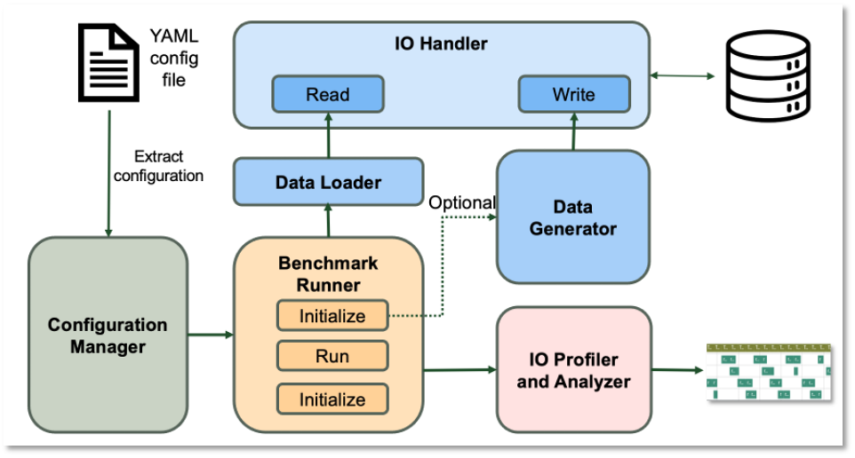

Profiling 
==========================
We have built in support for DLIO profiler, https://github.com/hariharan-devarajan/dlio-profiler. A profiler developed for capturing I/O calls. DLIO profiler supports profiling at both application levels and system I/O calls level. 

To enable this functionality, one has to install DLIO profiler throught 
```bash 
pip install dlio-profiler
```
or 
```bash
 git clone git@github.com:hariharan-devarajan/dlio-profiler.git
cd dlio-profiler
python setup.py build
python setup.py install
```
To enable DLIO profiling, set ```DLIO_PROFILER_ENABLE=1```. Other environemnt variables setting can be found here: https://dlio-profiler.readthedocs.io/en/latest/api.html#configurations-of-dlio-profiler. 

This will generate tracing files in the output folder, trace-$rank-of-$nproc.pfw. One can use https://ui.perfetto.dev/ to visualize the timeline trace: 



